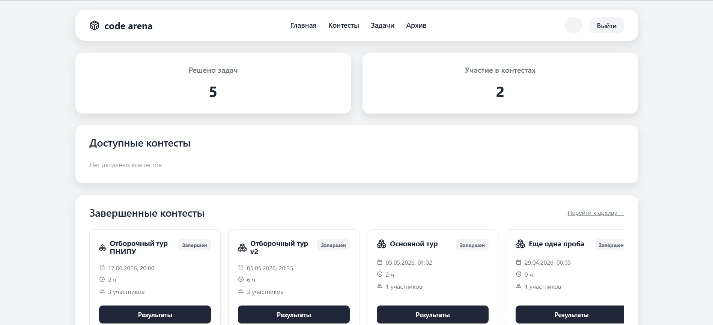

# Code Arena

**Платформа для проведения соревнований по программированию**, разработанная для кафедры ИТАС ПНИПУ.

Система позволяет организаторам создавать задачи и контесты, а участникам — решать задачи с автоматической проверкой кода в изолированных Docker-контейнерах.

---

## Возможности

### Для участников
- Регистрация и авторизация
- Участие в контестах
- Отправка решений на Python 3.8 и C++ 20
- Просмотр рейтинга участников с турнирной таблицей
- Архив своих решений с историей вердиктов

### Для организаторов
- Создание контестов 
- Создание задач 
- Автоматическая генерация эталонных выходных данных тестов

### Для администраторов
- Управление пользователями и их ролями

---

## Технологический стек

### Frontend
- **React 18** — UI-библиотека
- **React Router v6** — маршрутизация
- **Vite** — сборщик
- **CSS** — стилизация
- **React Icons** — иконки

### Backend
- **FastAPI** — асинхронный веб-фреймворк
- **SQLAlchemy 2.0** — ORM (async)
- **PostgreSQL** — основная БД
- **Redis** — брокер сообщений + кэш
- **Celery** — очередь задач для проверки решений
- **Docker** — изолированное выполнение кода участников
- **JWT** — аутентификация (access + refresh токены)
